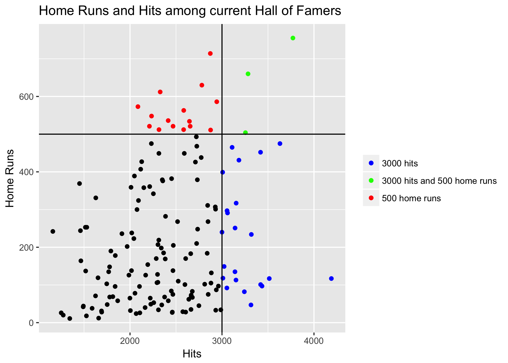
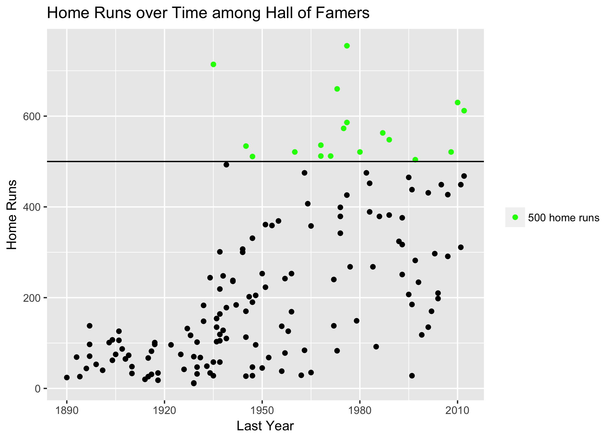

```{r include = FALSE}
source('code/create-graphs.R')
```

###Introduction
With the recent results of the 2018 Hall of Fame Induction, and the ninth straight year of Edgar Martinez being snubbed (biased Mariner's fan), the question can be once again brought up, what exactly is a Hall of Famer?

Of course, there's no one end-all answer to this question. Various circumstances arise and it is a Hall of Fame, not a Hall of Best Statistics, after all. With that in mind, let's do our best to create an answer.

#####A Note on the Impact of Performance Enhancing Drugs and Other Factors
One thing that makes statistical analyses like this difficult are the many outside factors that find their way into the picture. In baseball, the biggest issue is probably the precense of performance enhancing drugs. The controversy over the issue has become a large factor on Hall of Fame voting, and thus players who would be in based on statistics but are not because of this will be treated as outliers and omitted. Other outliers are those who have been banned from baseball for various reasons. Players that will be ignored include Barry Bonds, Roger Clemens, Pete Rose, Rafael Palmeiro, etc.

###The Old Consensus
Before the recent shift toward "advanced" statistics, it seemed like Hall of Fame voters used a few standard benchmarks in determining who was voted in. The four most common baselines include 3000 hits, 500 homeruns, 3000 strikeouts and 300 wins. 

####Hitters



#####500 Home Runs
For power hitters, 500 home runs seemed to be the baseline for entrance into the Hall of Fame. However, out of the `r numBatters` eligible (more than 4000 career at bats) players in the Hall, only `r hr500` of them have more than 500 home runs, making up merely `r percentOver500`% of eligible players in the Hall of Fame. In the past, reaching 500 home runs essentially guaranteed a Hall of Fame induction. Indeed, out of the 27 players with over 500 home runs, `r hr500` are currently in the Hall. However, even after subtracting the previously mentioned controversial players and those not yet eligible for voting, it seems that 500 home runs is no longer a guarantee, as Gary Sheffield still remains on the outside with 509 home runs. He and Fred McGriff (493 Home Runs) who both remain on the ballot, currently sit well below the required 75% on Hall of Fame voting, and barring a sudden uptick in votes, will most likely not gain entrance into the Hall. 


Over time, there has been a large increase of homeruns per game, which means that for players, more and more home runs are being hit. This most likely will result in more and more players reaching that 500 home run mark, if average career lengths remain the same.


As shown, the number of home runs hit by Hall of Fame batters has increased 

Thus, while hitting 500 home runs still puts one in an elite group of players, it is no longer a guarantee toward entrance to the Hall of Fame. In the future, we may see an increase in players reaching 500 home runs, but not be considered as Hall of Famers. Players like Gary Sheffield and Fred McGriff may no longer be outliers, but rather a new trend. 

######3000 Hits
The other "magical number" for hitters is 3000 hits. Unlike the number for home runs, it seems that 3000 hits is a much "safer" milestone for hitters to reach in consideration of Hall of Fame induction. Out of the 31 players with over 3000 hits, all of the ones who meet our requirements for eligibility have been inducted into the Hall of Fame. Out of `r numBatters` eligible, `r hits3k` of them have 3000 hits and they make up `r percentOver3k`% of eligible players.


Unlike home runs, the number of hits per game has generally remained the same in the last 100 years. If this continues, 3000 hits will most like remain a "safe" milestone for Hall of Fame hitters. 

####Pitchers


#####300 Wins
Much like 3000 hits for hitters, 300 wins for a pitcher is virtually a guarantee for Hall of Fame induction. Out of the 24 pitchers with 300 wins, `r wins300` are in the Hall, with the sole omission being Roger Clemens, due to aforementioned reasons. In fact, out of the four benchmarks mentioned, 300 wins is probably the "safest" and most common, as `r percentOver300`% of eligible pitchers (more than 0 innings pitched), have 300 wins. The closest to 300 wins without induction is Bobby Matthews (297 wins), whom will be covered when looking at different eras of the sport.


Wins over time is harder to judge, as there will always only be as many wins available as there are games. Among Hall of Famers, we see that wins has remained consistent since the creation of the Hall, so 300 wins will most likely remain a benchmark for the future.

#####3000 Strikeouts
The last of the four "magical numbers" for Hall of Induction, 3000 strikeouts, is also a good indicator of Hall of Fame level play. There are 16 players with 3000 strikeouts, and the only non-Roger Clemens player is Curt Schilling, who looks to be on his way there. Out of the eligible pitchers in the Hall of Fame, `r percentOfSO3k` have 3000 strikeouts, which is not as common as 300 wins, but still a decent number. 


Similarly to what we see in the home runs per game graph above, we see a constant increase in strikeouts per game. 


Indeed, we see that the number of pitchers in the Hall with 3000 strikeouts has increased over the last 30 to 40 years. However, unlike home runs, there may be an explanation in why there is not an overall increase in the strikeout numbers per Hall of Fame player. Three thousand strikeouts is generally a number reached by starting pitchers. In 1980, the average number of innings pitched by a starting pitcher per game was 6.3, but by 2017, this number has dropped down to 5.5. So even though the number of strikeouts per game has increased, starting pitchers are pitching less of the game, meaning that we should not expect to see a lareg increase strikeouts for starting pitchers per season. 

#####Conclusion
In our analysis of the old consensus benchmarks for hitters, we see that while recently no longer a guarantee, reaching these numbers still gives one a very high chance of Hall entrance. Yet, when observing the first hitters graph, we see that `r no3kOr500`% of Hall of Famers do not reach either of these benchmark numbers. Just like with hitters in the Hall of Fame, these pitching benchmarks still result in high induction rates for Hall of Famers. However, as with hitters, we still see that in the first pitchers graph, `r no3kOr300`% of pitchers do not reach either mark. This shows that these four statistics, while great indicators of Hall of Fame level play, are not an end all to the discussion. 

###New Age Stats

####WAR


