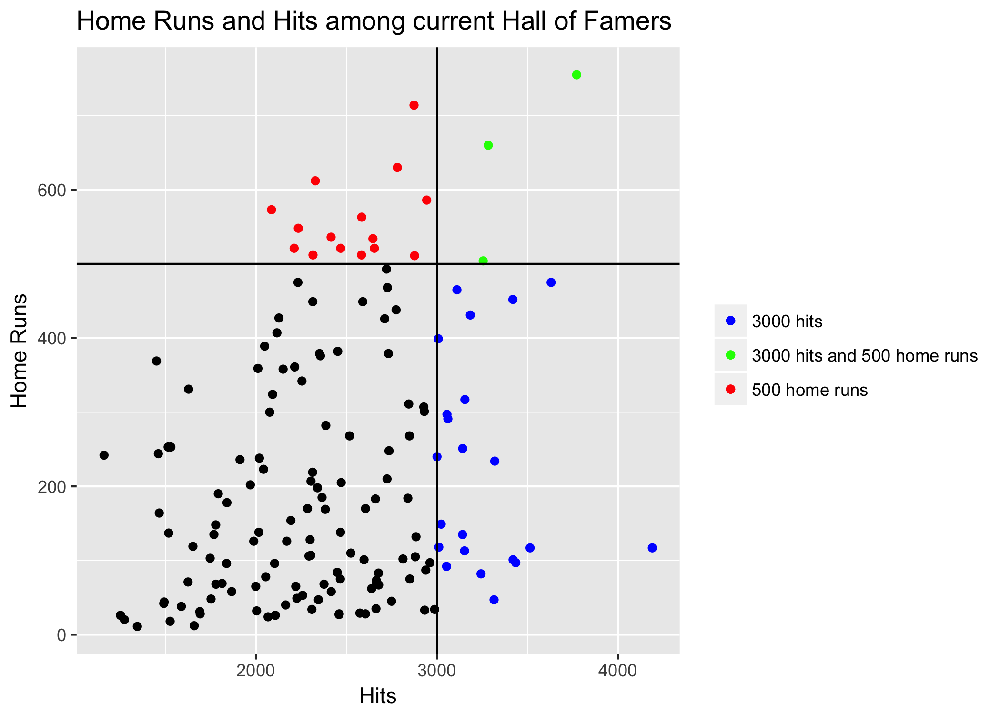
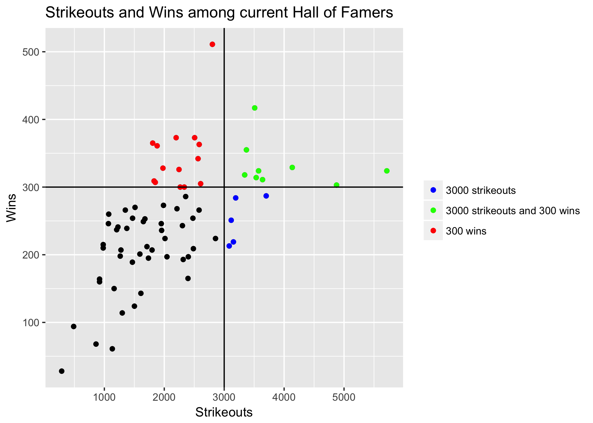

What’s in a Hall of Famer? (A Statistical Analysis)
================
Timothy Tan
February 5, 2018

### Introduction

With the recent results of the 2018 Hall of Fame Induction, and the ninth straight year of Edgar Martinez being snubbed (biased Mariner's fan), the question can be once again brought up, what exactly is a hall of famer?

Of course, there's no one end-all answer to this question. Various circumstances arise and it is a Hall of Fame, not a Hall of Best Statistics, after all. With that in mind, let's do our best to create an answer.

##### A Note on the Impact of Performance Enhancing Drugs and Other Factors

One thing that makes statistical analyses like this difficult are the many outside factors that find their way into the picture. In baseball, the biggest issue is probably the precense of performance enhancing drugs. The controversy over the issue has become a large factor on hall of fame voting, and thus players who would be in based on statistics but are not because of this will be treated as outliers and omitted. Other outliers are those who have been banned from baseball for various reasons. Players that will be ignored include Barry Bonds, Roger Clemens, Pete Rose, Rafael Palmeiro, etc.

### The Old Consensus

Before the recent shift toward "advanced" statistics, it seemed like Hall of Fame voters used a few standard benchmarks in determining who was voted in. The four most common baselines include 3000 hits, 500 homeruns, 3000 strikeouts and 300 wins.

#### Hitters

##### 500 Home Runs

For power hitters, 500 home runs seemed to be the baseline for entrance into the hall of fame. However, out of the 157 eligible (more than 4000 career at bats) players in the hall, only 18 of them have more than 500 home runs, making up merely 11.46% of eligible players in the hall of fame. In the past, reaching 500 home runs essentially guaranteed a hall of fame induction. Indeed, out of the 27 players with over 500 home runs, 18 are currently in the hall. However, even after subtracting the previously mentioned controversial players and those not yet eligible for voting, it seems that 500 home runs is no longer a guarantee, as Gary Sheffield still remains on the outside with 509 home runs. He and Fred McGriff (493 Home Runs) who both remain on the ballot, currently sit well below the required 75% on hall of fame voting, and barring a sudden uptick in votes, will most likely not gain entrance into the hall. Thus, while hitting 500 home runs gives one a very very good chance, it is no longer a guarantee toward entrance.

###### 3000 Hits

The other "magical number" for hitters is 3000 hits. Unlike the number for home runs, it seems that 3000 hits is a much "safer" milestone for hitters to reach in consideration of hall of fame induction. Out of the 31 players with over 3000 hits, all of the ones who meet our requirements for eligibility have been inducted into the hall of fame. Out of 157 eligible, 25 of them have 3000 hits and they make up 15.92% of eligible players.

##### Conclusion

In our analysis of the old consensus benchmarks for hitters, we see that while recently no longer a guarantee, reaching these numbers still gives one a very high chance of hall entrance. Yet, when observing the graph above, we see that 74.52% of hall of famers do not reach either of these benchmark numbers. This means that there are clearly other factors which play into hall of fame induction for hitters.

#### Pitchers

##### 300 Wins

Much like 3000 hits for hitters, 300 wins for a pitcher is virtually a guarantee for hall of fame induction. Out of the 24 pitchers with 300 wins, 23 are in the hall, with the sole omission being Roger Clemens, due to aforementioned reasons. In fact, out of the four benchmarks mentioned, 300 wins is probably the "safest" and most common, as 31.94% of eligible pitchers (more than 0 innings pitched), have 300 wins. The closest to 300 wins without induction is Bobby Matthews (297 wins), whom will be covered when looking at different eras of the sport.

##### 3000 Strikeouts

The last of the four "magical numbers" for Hall of Induction, 3000 strikeouts, is also a good indicator of hall of fame level play. There are 16 players with 3000 strikeouts, and the only non-Roger Clemens player is Curt Schilling, who looks to be on his way there. Out of the eligible pitchers in the hall of fame, 19.44 have 3000 strikeouts, which is not as common as 300 wins, but still a decent number.

##### Conclusion

Just like with hitters in the hall of fame, these pitching benchmarks still result in high induction rates for hall of famers. Yet, as with hitters, we still see that in the graph above, 61.11% of pitchers do not reach either mark, once again showing that there must be a more to a hall of famer than just those two stats.

### New Age Stats
